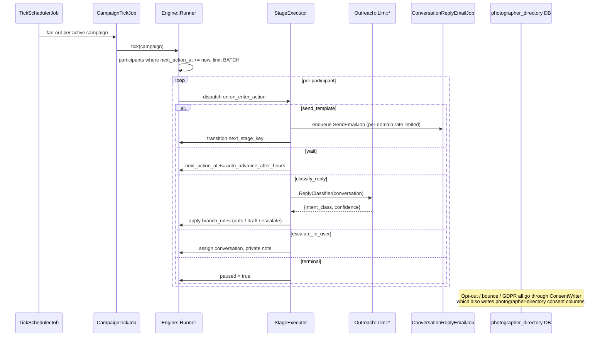

# Chatwoot — Generic Outreach Engine + Photographer Partnership Pipeline

## Overview

Build a generic, rules-as-data outbound campaign engine in chatwoot, with the photographer partnership program as its first concrete pipeline. The engine drives intro → reminder → breakup email sequences, classifies replies with an LLM, routes to auto-send / operator-draft / escalate based on confidence, and attributes signups back from framky.com via webhook. The photographer-directory Postgres database is integrated as a **primarily-read, write-limited-scope** secondary connection — chatwoot reads leads and writes only consent fields (`marketing_consent`, `unsubscribed_from_all_campaigns`, `gdpr_delete_requested_at`) so opt-outs performed in chatwoot are immediately authoritative in the directory.

This plan covers **only the chatwoot side** (§6, §9.7–§9.12, §10 of the source document). The frami-composer Django backend and framky-frontend changes are planned separately.

## Problem Frame

- Framky needs scalable outbound outreach to photographers (MVP: ~5 000 leads) with light operator touch.
- Existing `InfluencerProfile` / `Campaign` models do not fit: influencer outreach is sponsored-content per-post; `Campaign` is coupled to SMS/WhatsApp broadcast, not stateful email sequences.
- Architecture must generalize so future partner types (interior designers, florists, businesses) need only a new blueprint YAML + new domain pipeline model, no engine changes.
- Opt-out must be propagated to photographer-directory (source of truth for lead data) so the next sync does not resurrect an opt-out'd lead.
- Signup attribution happens on framky.com (Django) but must land on the right chatwoot conversation/participant for pipeline progression.

## Requirements Trace

- **R1.** Generic engine drives state machine defined in data (`outbound_campaigns`, `campaign_pipeline_stages`, `campaign_templates`). (§6.1, §6.2, §6.4, §6.5)
- **R2.** Photographer pipeline model (`PhotographerPartnerProfile`) separate from `InfluencerProfile`; linked via polymorphic `CampaignParticipant`. (§6.1, §6.2)
- **R3.** Intro email (T=0), reminder (T+5d), breakup (T+14d) auto-sent; reminder/breakup suppressed on reply. (§4.2, §6.4)
- **R4.** LLM reply classifier covers 8 intent classes; routing by confidence thresholds (≥0.85 auto, 0.5–0.85 draft, <0.5 escalate). (§4.3, §6.6)
- **R5.** Secondary DB connection to photographer-directory with app-level + DB-role-level read-only enforcement except for three consent columns. (§6.7, §9.8)
- **R6.** `ConsentWriter` is the sole write path to photographer-directory; every opt-out/bounce/GDPR-delete triggers propagation with retry + audit event. (§6.7, §6.12, §9.9)
- **R7.** `List-Unsubscribe` + one-click `List-Unsubscribe-Post` headers (RFC 8058) on every outbound mail; HMAC-signed token resolves without lookup table. (§6.12)
- **R8.** Rate limiting per recipient-domain (default 50/h per sender domain) via Redis token bucket. (§6.8)
- **R9.** Attribution webhook `POST /webhooks/outreach/partnership_signup` (HMAC-signed) transitions participant to `signed_up` and logs an attribution event. (§6.9)
- **R10.** Vue "Outreach" sidebar section with Campaigns, Photographers, Drafts-to-review, Analytics. (§6.10)
- **R11.** Cross-system audit job daily reports drift between `PhotographerPartnerProfile.do_not_contact` and `photographer_photographers.marketing_consent`. (§9.9)
- **R12.** LLM cost per profile ≈ $0.007 (Claude Haiku 4.5 via existing `base_ai_service.rb`). (§6.14)

## Scope Boundaries

- Only the chatwoot repo. Django (frami-composer) and Next.js (framky-frontend) changes are out of scope.
- Photographer as the **only** concrete pipeline shipped. Designer / influencer / florist / business pipelines are post-MVP (§11).
- No SMS / WhatsApp / LinkedIn channels — email only. Generic engine must not block future channels, but no non-email executor in this plan.
- No inbound email classification beyond replies to outbound threads.
- No A/B testing infrastructure for intro copy (post-MVP, §8 Phase 5).

### Deferred to Separate Tasks

- **Django backend (`frami-composer`)**: `/photographers/partnership/register/`, `Coupon.kind`, `CommissionLedger.order` FK, signal `on_order_paid`, Celery lock-in, Stripe `charge.refunded` → `COMMISSION_RETURN`. Planned in a separate frami-composer plan.
- **framky-frontend**: `/partnerships/panel/*`, real register form, `src/proxy.ts` short-link extension, `src/lib/partnership-reserved-handles.ts`. Planned separately.
- **Secondary DB role provisioning**: `CREATE ROLE photographer_directory_outreach` + column-level `GRANT UPDATE` must happen in photographer-directory repo/migration. Coordinated with that repo's owner (§9.8).
- **Sunset of `framky-affiliate-panel`**: data migration + 301 redirect (§7) — separate cleanup task after launch.

## Context & Research

### Relevant Code and Patterns

- `app/services/influencers/snapshot_importer.rb` — upsert importer pattern (batched, idempotent). Copy shape for `Outreach::PhotographerDirectory::Importer`.
- `app/services/llm_formatter/conversation_llm_formatter.rb` — input formatter pattern for LLM prompts. Copy for `PhotographerPartnerLlmFormatter`.
- `enterprise/app/services/llm/base_ai_service.rb` — base class (RubyLLM + `Llm::Config`). All three `Outreach::Llm::*` services inherit from this.
- `app/jobs/conversation_reply_email_job.rb` — existing email-send job that targets an `Inbox`. Wrap, not replace, in `Outreach::SendEmailJob`.
- `app/javascript/dashboard/components-next/sidebar/Sidebar.vue` — sidebar entry insertion point.
- `enterprise/app/javascript/dashboard/components-next/Influencers/` (if present) or `app/javascript/dashboard/modules/` — kanban/list patterns. **Copy, do not extend** — influencer domain is distinct.
- `app/services/influencers/` generally — service-per-action naming convention (`approve_service.rb`, `reject_service.rb`).
- `config/database.yml` — already `default: &default` anchored; new `photographer_directory:` entry follows same shape.
- `config/llm.yml` — existing feature-key pattern; add `outreach_compose`, `outreach_classify`.

### Institutional Learnings

- Check `docs/solutions/` for secondary-DB-connection, Sidekiq-rate-limiting, or polymorphic-join patterns before implementing. If a prior solution exists for multi-tenant rate limiting or HMAC-signed webhook endpoints, prefer its shape.
- Prior plans in `docs/plans/` for influencer work (`2026-02-25-feat-influencer-collaboration-management-plan.md`, `influencer-discovery/`) establish the snapshot-importer pattern and the `components-next` Vue structure — use as shape references.

### External References

- RFC 8058 — one-click `List-Unsubscribe-Post: List-Unsubscribe=One-Click`. Gmail/Yahoo enforce for bulk senders.
- Rails multi-DB: `ActiveRecord::Base.connects_to` with per-abstract-class `database: { reading:, writing: }` — needed for `PhotographerDirectory::ApplicationRecord`.
- Sidekiq token-bucket rate limiting via Redis (sliding window keyed on recipient domain).

### Organizational Context

- User explicitly rejects reusing `InfluencerProfile` — influencer outreach is a different domain (sponsored content per-post) from partnership. Plan treats them as separate.
- User confirmed photographer-directory as **source of truth** for consent. Chatwoot must never be the sole holder of an opt-out.
- User confirmed secondary connection with write-limited scope; role must enforce at DB level, not just app level.

## Key Technical Decisions

- **Rules-as-data state machine over per-program Ruby**: every stage transition is a row in `campaign_pipeline_stages`. One `Runner#tick` interprets them. Rationale: adding designer/florist pipelines in post-MVP costs one YAML file + one profile model, not an engine rewrite (§1.3, §11.3).
- **Polymorphic `CampaignParticipant`**: `participatable_type`/`participatable_id` link engine to domain pipeline. Keeps domain tables free of engine concerns. Rationale: `PhotographerPartnerProfile` owns partnership_status lifecycle; engine owns stage progression — they share via the join.
- **Secondary DB connection + column-level grants**: app-level `attr_readonly` is a convenience; DB role grants are the real boundary. Rationale: a bug in any code path must be incapable of overwriting `email` or `business_name` in photographer-directory (§6.7, §9.8).
- **`ConsentWriter` as sole write path**: every write to photographer-directory goes through this service with Sidekiq retry and audit-event logging. Rationale: consistency between chatwoot and directory is a correctness property, not best-effort (§6.12, §9.9).
- **HMAC-signed unsubscribe tokens, no lookup table**: token encodes participant_id + timestamp + campaign_id, signed with shared secret. Rationale: one-click unsubscribe must be stateless and survive DB outages; lookup tables also create a tracking-surface-area problem.
- **Per-locale inbox, not per-sender**: one inbox per locale (de, pl, en …) for deliverability + clean DKIM. Rationale: spreading sending across inboxes at per-campaign granularity hurts domain reputation (§9.11).
- **Claude Haiku 4.5 as default for compose + classify**: per §6.14 cost model. Rationale: at ≈$0.007/profile, cost is negligible for 5k leads. Escalation to Sonnet stays available via `config/llm.yml` override if classifier quality is insufficient.
- **Blueprint YAML + `rake outreach:blueprints:apply`**: upsert by `(program_key, stage.key)` and `(program_key, slot, locale)`. Rationale: enables in-app editing later (`CampaignPipelineEditor.vue`) while keeping a git-versioned source of truth.
- **Do NOT reuse `app/models/campaign.rb`**: it is SMS/WhatsApp-broadcast coupled. New namespace `OutboundCampaign` is independent. Rationale: conflating fundamentally different sending semantics is a classic trap (§10 "NIE reuse").

## Open Questions

### Resolved During Planning

- **Reuse `InfluencerProfile` for photographers?** — No. Explicit user rejection; domain differs (§6.1).
- **Reuse `Campaign` model?** — No. SMS/WhatsApp broadcast coupling (§10).
- **Signup attribution transport?** — HMAC-signed webhook `POST /webhooks/outreach/partnership_signup` from Django (§6.9, R9).
- **Unsubscribe transport?** — HMAC-signed token in `GET /unsubscribe/:token`, no lookup table. One-click per RFC 8058.
- **Opt-out propagation path to photographer-directory?** — `ConsentWriter` service, secondary connection, column-level grants (§6.7, §6.12).

### Deferred to Implementation

- **Exact Redis key schema for rate limiting** — decided during C3 implementation after reviewing existing Sidekiq middleware patterns in the repo.
- **Shared secret name + rotation policy for webhook/unsubscribe HMAC** — coordinate with frami-composer deploy before C7; likely `ENV['OUTREACH_WEBHOOK_SECRET']` and `ENV['OUTREACH_UNSUBSCRIBE_SECRET']`.
- **Final LLM prompt wording per locale** — iterate during C4 with 20-profile smoke test (§8 Phase 3 final item).
- **Kanban stage grouping UX** — pipeline kanban in C5 may collapse `reminder_wait`/`breakup_wait` into parent `waiting` column; decided during Vue work.

### Resolved 2026-04-22 (C0 unblocked)

- **Q1 (was §9.7) — DB credentials & transport**: chatwoot and photographer-directory co-locate on server-framky. Prod connects to `localhost:5432`; dev connects via Tailscale `10.0.1.1:5432`. Single connection string env `PHOTOGRAPHER_DIRECTORY_DATABASE_URL` (Rails consumes via `config/database.yml`). Password stored in `.env` (prod: `/srv/chatwoot/chatwoot/.env`, dev: `./chatwoot/.env`).
- **Q2 (was §9.8) — Role provisioning**: idempotent TypeScript migration at `photographer-directory/packages/database/src/scripts/setup-chatwoot-outreach-role.ts` reads `CHATWOOT_OUTREACH_DB_PASSWORD` env and provisions role + grants. First bootstrap ran as postgres superuser via `psql` (2026-04-22); future rotations via `pnpm --filter @photographer-catalog/database setup:chatwoot-outreach-role` with `SUPERUSER_DATABASE_URL` env.
- **Q3 — Email inbox strategy**: single inbox `photographers@framky.com` (not per-locale). Locale personalization happens at template render via `CampaignTemplate.locale`; chatwoot natively supports multi-language per-conversation.
- **Q4 — LLM provider**: OpenRouter, model `deepseek/deepseek-v3.2-exp` for compose/classify/draft. Per-feature env overrides (`OUTREACH_LLM_COMPOSE_MODEL`, `OUTREACH_LLM_CLASSIFY_MODEL`, `OUTREACH_LLM_DRAFT_MODEL`). Chosen over GLM-4.6 for 4× cost advantage at equivalent quality for short structured JSON + template-guided compose.
- **Q5 — Terms of service (regulamin)**: frontend-owned, accepted as-is. Chatwoot links to `framky.com/{locale}/program-partnerski/regulamin` from intro mail footer.
- **Q6 — Existing CRM infra in photographer-directory**: discovered live outreach CRM (`email_campaigns`, `email_sends` 4722 rows, `photographer_campaign_status` 2185 rows, Gmail-API-based crawler workers). Driving the **"Recommended Photographer Network"** onboarding campaign. **Decision: Option C — parallel campaigns**. Current CRM keeps running untouched for onboarding; chatwoot implements the **partnership** program per §6 from scratch. Exclusion scope in importer: skip photographers present in `photographer_campaign_status WHERE completed_at IS NULL AND unsubscribed_from_campaign = false` (~2 168 photographers as of 2026-04-22). Additional `GRANT SELECT` on `photographer_campaign_status` added to the outreach role. Long-term convergence (kill onboarding CRM, migrate everything to chatwoot workflow engine) is tracked against `photographer-directory/CRM-WORKFLOW.md` as a separate post-MVP initiative.

### Still Blocking

- None. C0 is unblocked; C1 (data layer) can start.

## Implementation Progress (2026-04-22)

**Status**: C1 + C2 landed on `framky/main` (no branch, no worktree — explicit user preference). Ready for hands-on testing.

### Commits

| SHA | Unit | Summary |
|-----|------|---------|
| `29e5144e1` | **C1.1** | 8 migrations for engine + pipeline tables (`outbound_campaigns`, `campaign_pipeline_stages`, `campaign_templates`, `photographer_partner_profiles`, `campaign_participants`, `campaign_llm_decisions`, `campaign_drafts`, `campaign_attribution_events`) |
| `a9fa36cd2` | **C1.2** | 8 ActiveRecord models + 8 factories + model specs (OutboundCampaign, CampaignParticipant, PhotographerPartnerProfile). 30 examples |
| `935dd877b` | **C1.3** | `db/campaign_blueprints/photographer_partnership.yml` (10 stages, 15 templates) + `Outreach::BlueprintApplier` + rake `outreach:blueprints:apply[account_id]`. 9 applier specs |
| `93fca97d8` | **C2.1** | Secondary DB connection to `photographer_directory` + `PhotographerDirectory::{ApplicationRecord,Photographer}` with `attr_readonly` on every non-consent column |
| `3d9bd29a4` | **C2.2** | `Outreach::PhotographerDirectory::{Importer,SyncJob,ScheduledSyncJob}` + rake `outreach:photographers:import` + sidekiq `outreach` queue + cron (6h). Added `PhotographerDirectory::CampaignStatus` + `GRANT SELECT` on prod for Option C exclusion |
| `3c6129679` | **C2.3** | `Outreach::PhotographerDirectory::ConsentWriter` (sole write path) + `PropagateConsentJob` (retry 5×). Idempotent 24h window. Synthetic-participant fallback for consent audit when no participant exists |

**Suite**: 67/67 specs green, 0 rubocop offenses on new code.

### What's provisioned outside chatwoot

- **Prod DB role** `photographer_directory_outreach` on server-framky Postgres, `SELECT` on `photographer_photographers` + `photographer_campaign_status`, column-level `UPDATE` on the 4 consent columns. See [photographer-directory `setup:chatwoot-outreach-role` script](../../../photographer-directory/packages/database/src/scripts/setup-chatwoot-outreach-role.ts).
- **Env vars** in `/srv/chatwoot/chatwoot/.env` (prod, `localhost`) and `./chatwoot/.env` (dev, `10.0.1.1` via Tailscale): `PHOTOGRAPHER_DIRECTORY_DATABASE_URL`, `OUTREACH_LLM_*`, `OUTREACH_PARTNERSHIP_WEBHOOK_SECRET`. Template entries also in `.env.example`.

### Dry-run verifications on dev DB

- `bundle exec rake "outreach:blueprints:apply[1]"` → creates 10 stages, 15 templates for Framky account (id=1). Re-run is idempotent (no row churn).
- `bundle exec rake "outreach:photographers:import[1]"` → currently returns `imported=0 updated=0` because all 18 `queryable_for_outreach` photographers on prod are enrolled in the active photographer-directory onboarding CRM (`photographer_campaign_status`). **Option C exclusion working as intended** — partnership outreach will pick them up once they complete onboarding.

### Ready-to-test paths

1. **Blueprint idempotency** — `rails c`, edit a template body in YAML, re-apply, inspect `CampaignTemplate` row (expect update in place, no duplicate).
2. **Importer on synthetic data** — temporarily bypass the Option C exclusion by opening `rails c`, building an `Outreach::PhotographerDirectory::Importer` with a stubbed `source_query`, and calling `perform`. Or populate `PhotographerPartnerProfile` directly and work downstream.
3. **ConsentWriter end-to-end** — `rails c`, pick a profile, call `Outreach::PhotographerDirectory::ConsentWriter.new(profile).propagate_opt_out(reason: 'manual_test')`. Verify on photographer-directory DB: `SELECT marketing_consent, unsubscribed_from_all_campaigns FROM photographer_photographers WHERE id = <profile.external_id>`. **Warning**: this writes to prod directory — pick a test row (ideally an internal/dummy photographer) or just verify the flow on dev DB by swapping URLs temporarily.
4. **Sidekiq queue** — start sidekiq with `-q outreach`, call `Outreach::PhotographerDirectory::SyncJob.perform_later(1)`, confirm it picks up.
5. **Sidekiq cron** — `sidekiq-cron` loads `config/schedule.yml` on boot. New entry `outreach_photographer_directory_scheduled_sync_job` fires every 6h; can be triggered manually from the Sidekiq web UI once that panel is reachable.

### Deviations from plan worth knowing

- **`external_id` is `string`, not UUID.** Plan §6.2 assumed UUID; photographer-directory real schema uses `bigint`. Chose `string` for interop safety (importer calls `source.id.to_s`).
- **Option C exclusion** added to the importer (new `PhotographerDirectory::CampaignStatus` secondary model, extra `GRANT SELECT`). Plan anticipated this in Q6 resolution but didn't spell out the code shape.
- **Synthetic CampaignParticipant** on consent writes when none exists (stage=`terminal`, `paused=true`, `metadata.synthetic_for_consent_audit=true`). Not in plan; needed because attribution events belong to a participant. Discoverable via that metadata flag.
- **`opt_out!` has no `reason:` kwarg** on the model. Reason lives in `CampaignAttributionEvent.payload` — model stays signature-clean.
- **Two additional blueprint stages**: `auto_reply_commission` and `auto_reply_product` targeting the existing reply-intent templates. They are referenced by `branch_rules` in `reply_router`, so they must exist. Plan §6.4 didn't enumerate them explicitly.
- **Blueprint `upsert_stages` uses a two-pass save** to avoid tripping the `next_stage_key` validation during partial application. Core attrs first, then cross-stage wiring.
- **Compact class/module form** where bare constant resolution matters (`class Outreach::PhotographerDirectory::SyncJob`): every cross-reference to a sibling class is **fully qualified** (`Outreach::PhotographerDirectory::Importer`, not `Importer`). Rubocop autocorrect would otherwise break lookup silently.
- **Lint**: `config/database.yml` was intentionally excluded from rubocop runs — rubocop parses it as Ruby and crashes on YAML syntax. If CI runs rubocop on all files, add an exclusion.

### Known non-blockers / housekeeping

- `bundle exec rake db:migrate` prints a trailing `annotate_models` TypeError (unrelated to this work — pre-existing gem bug on Rails 7.1 + Ruby 3.4).
- Mass reapply of the blueprint currently deletes unlisted stages. This is intentional for engine wiring, but watch out if you start doing schema edits per-account.
- Test suite for `PhotographerDirectory::Photographer` skips 5 of 6 examples when `PHOTOGRAPHER_DIRECTORY_DATABASE_URL` is unset. To run them all locally: `PHOTOGRAPHER_DIRECTORY_DATABASE_URL=... bundle exec rspec spec/models/photographer_directory/photographer_spec.rb`.

### What C3 will need first

- Decision on LLM provider wiring in `ruby_llm` (OpenRouter via `openai` adapter with custom base URL is the working assumption; `OUTREACH_LLM_*` env already set).
- `OUTREACH_LLM_API_KEY` value (currently empty in both `.env` files).
- `OUTREACH_PARTNERSHIP_WEBHOOK_SECRET` value for C7 (currently empty).
- Minimal operator user for `OutboundCampaign.sender_user_id` — C3 escalate executor assigns conversations to someone.

## High-Level Technical Design

> *This illustrates the intended approach and is directional guidance for review, not implementation specification. The implementing agent should treat it as context, not code to reproduce.*

### Engine data model

    OutboundCampaign (program_key='photographer_partnership', inbox_id, config jsonb)
      ├─ CampaignPipelineStage (key, on_enter_action, next_stage_key, branch_rules jsonb)
      ├─ CampaignTemplate (slot, locale, subject, body, llm_guidance)
      └─ CampaignParticipant (participatable → PhotographerPartnerProfile,
                              current_stage_key, next_action_at, conversation_id)
           ├─ CampaignLlmDecision (audit trail; decision_type, input_digest, output jsonb, confidence, routed_to)
           ├─ CampaignDraft (pending_review | approved | rejected | sent)
           └─ CampaignAttributionEvent (partnership_signup | unsubscribe | email_bounce | gdpr_delete)

### Runner tick loop (every 5 min per campaign)

### Inbound → pipeline integration

The email channel already delivers replies as `Message`s on `Conversation`. A `Conversation#after_create_message` observer (or listener on existing `message.created` event) that matches `conversation.additional_attributes['campaign_participant_id']` enqueues the participant into `reply_router` stage. No bespoke inbound polling.

## Implementation Units

Units are grouped by the source document's C0–C7 phasing. Each unit is commit-sized; a couple are larger and explicitly call that out.

---

- [ ] **Unit C0.1: Spike — photographer-directory DB reachability + LLM config approval**

**Goal:** Confirm network path, credentials, and DB role grants work end-to-end from a chatwoot container (dev + staging). Get sign-off on Claude Haiku 4.5 as the default `outreach_*` model.

**Requirements:** R5, R12

**Dependencies:** Q1, Q2 answers from infra / photographer-directory owner.

**Files:**
- Modify: `config/database.yml` — add `photographer_directory:` section under `default` anchor (development + test + production)
- Modify: `config/llm.yml` — add `outreach_compose` and `outreach_classify` feature keys pointing at Claude Haiku 4.5
- Create: `config/credentials.example.yml` entry or `.env.example` additions documenting `POSTGRES_PD_*` + `OUTREACH_WEBHOOK_SECRET` + `OUTREACH_UNSUBSCRIBE_SECRET`

**Approach:**
- Dev spike: raw `ActiveRecord::Base.establish_connection` in a rails-runner script, `SELECT count(*) FROM photographer_photographers` and a dry-run `UPDATE ... RETURNING` on the consent columns only, confirming grants.
- Document outcome in a short memo committed to `docs/solutions/` (spike result only, not full architecture) per repo conventions.
- Escalate if the role lacks column-level grants — block C2 until fixed.

**Execution note:** Investigation, not permanent code. Revert the spike script once outcomes are captured.

**Patterns to follow:**
- `config/database.yml` `default: &default` anchor shape.
- Existing `config/llm.yml` feature-key entries.

**Test scenarios:**
- Happy path: rails-runner connects to photographer-directory, selects, updates only `marketing_consent`, and an attempted `UPDATE email` raises `ActiveRecord::StatementInvalid` (permission denied).
- Error path: if role is missing or grants incomplete, the spike fails loudly with the exact grant statement needed.

**Verification:**
- Connection works in dev and staging.
- Column-level grants verified by explicit denial of an `email` write.
- LLM feature keys load without errors via `Llm::Config.fetch(:outreach_compose)`.

---

- [x] **Unit C1.1: Data-layer migrations for the generic engine** — `29e5144e1`

**Goal:** Create all engine + pipeline tables with their indexes. No behavior yet.

**Requirements:** R1, R2

**Dependencies:** None.

**Files:**
- Create: `db/migrate/<ts>_create_photographer_partner_profiles.rb`
- Create: `db/migrate/<ts>_create_outbound_campaigns.rb`
- Create: `db/migrate/<ts>_create_campaign_pipeline_stages.rb`
- Create: `db/migrate/<ts>_create_campaign_templates.rb`
- Create: `db/migrate/<ts>_create_campaign_participants.rb`
- Create: `db/migrate/<ts>_create_campaign_llm_decisions.rb`
- Create: `db/migrate/<ts>_create_campaign_drafts.rb`
- Create: `db/migrate/<ts>_create_campaign_attribution_events.rb`
- Modify: `db/schema.rb` (regenerated)

**Approach:**
- Follow column specs in source doc §6.2 exactly.
- Unique indexes: `(outbound_campaign_id, program_key)`, `(outbound_campaign_id, participatable_type, participatable_id)`, `(account_id, external_id)` on profiles, `(outbound_campaign_id, slot, locale) WHERE active`.
- Query indexes: `(outbound_campaign_id, current_stage_key, next_action_at)` for the hot path of `Runner#tick`.
- `jsonb` for `config`, `audience_source_config`, `branch_rules`, `output`, `metadata`, `payload`.
- Foreign keys with `on_delete: :cascade` for child tables; null FK for `conversation_id` (lazy creation).

**Patterns to follow:**
- Existing migrations in `db/migrate/` — timestamps, `t.references`, `add_index`.

**Test scenarios:**
- Happy path: `rake db:migrate` then `rake db:rollback STEP=8` then re-migrate succeeds.
- Edge case: unique indexes prevent duplicate `(outbound_campaign_id, slot, locale)` for active templates but allow inactive duplicates.
- Edge case: partial index `WHERE active = true` respects NULL / false rows (Postgres semantics).

**Verification:**
- All 8 tables exist with indexes as specified.
- `db:rollback` + `db:migrate` is clean.
- `schema.rb` diff is contained to these tables.

---

- [x] **Unit C1.2: Engine + pipeline ActiveRecord models** — `a9fa36cd2`

**Goal:** Model classes with associations, enums, validations, and scopes. No business logic yet beyond associations.

**Requirements:** R1, R2

**Dependencies:** Unit C1.1

**Files:**
- Create: `app/models/outbound_campaign.rb`
- Create: `app/models/campaign_pipeline_stage.rb`
- Create: `app/models/campaign_template.rb`
- Create: `app/models/campaign_participant.rb`
- Create: `app/models/photographer_partner_profile.rb`
- Create: `app/models/campaign_llm_decision.rb`
- Create: `app/models/campaign_draft.rb`
- Create: `app/models/campaign_attribution_event.rb`
- Test: `spec/models/outbound_campaign_spec.rb`
- Test: `spec/models/campaign_participant_spec.rb`
- Test: `spec/models/photographer_partner_profile_spec.rb`

**Approach:**
- `OutboundCampaign` `belongs_to :account`, `has_many :pipeline_stages`, `has_many :templates`, `has_many :participants`. `enum status: %i[draft active paused archived]`.
- `CampaignPipelineStage` — `belongs_to :outbound_campaign`. `enum on_enter_action`. Validate `next_stage_key` points to an existing stage key in same campaign (soft validation; not enforced in DB because branch_rules may point anywhere).
- `CampaignTemplate` — active-scope. Unique per `(campaign, slot, locale)` while `active`.
- `CampaignParticipant` — `belongs_to :outbound_campaign, :account, :participatable, polymorphic: true, :conversation (optional), :contact (optional)`. Scope `due_for_tick`: `where('next_action_at <= ?', Time.current).where(paused: false)`.
- `PhotographerPartnerProfile` — `enum partnership_status`, validations on email/external_id presence. Scope `active_outreach`.
- `CampaignLlmDecision`, `CampaignDraft`, `CampaignAttributionEvent` — basic associations, enums.

**Patterns to follow:**
- Existing models under `app/models/` use `belongs_to :account` for account scoping; follow that pattern.
- `enum` style matches existing Chatwoot models.

**Test scenarios:**
- Happy path: Create `OutboundCampaign` + stages + templates; polymorphic `CampaignParticipant.find_or_create_by(participatable: photographer_profile)` resolves.
- Edge case: two `CampaignTemplate` rows with `active: false` for same `(campaign, slot, locale)` — both persist.
- Edge case: `active: true` duplicate — raises `ActiveRecord::RecordNotUnique`.
- Edge case: `CampaignParticipant.due_for_tick` excludes paused and future-dated rows.
- Error path: `PhotographerPartnerProfile` without `email` fails validation.

**Verification:**
- Factories for all new models land in `spec/factories/`.
- All spec files pass; no touched OSS specs break.

---

- [x] **Unit C1.3: Blueprint YAML + apply rake task** — `935dd877b`

**Goal:** Declarative pipeline definition with idempotent upsert.

**Requirements:** R1, R3, R4

**Dependencies:** Unit C1.2

**Files:**
- Create: `db/campaign_blueprints/photographer_partnership.yml`
- Create: `lib/tasks/outreach.rake`
- Create: `app/services/outreach/blueprint_applier.rb`
- Test: `spec/services/outreach/blueprint_applier_spec.rb`
- Test: `spec/lib/tasks/outreach_rake_spec.rb`

**Approach:**
- YAML structure per §6.4: `program_key`, `name`, `default_locale`, `stages: [...]`, `templates: [...]` (intro, reminder, breakup, 8 × reply_* per locale).
- `rake outreach:blueprints:apply` loads all YAMLs, upserts by `(program_key, stage.key)` and `(program_key, slot, locale)`.
- Transactional per campaign — either whole blueprint applies or nothing.
- Deactivate templates not present in YAML (`active: false`) rather than delete, preserving audit trail.

**Patterns to follow:**
- Existing `lib/tasks/` rake files — namespace, description, idempotent.

**Test scenarios:**
- Happy path: First apply creates rows; second apply is a no-op at DB-row level for unchanged content.
- Edge case: Editing a template body updates the existing row (detected by `(slot, locale)` match).
- Edge case: Removing a template from YAML flips `active: false` on the existing row.
- Error path: Invalid YAML (missing required key) raises a loud error naming the file.
- Error path: Partial failure rolls back — no half-applied campaign.

**Verification:**
- `rake outreach:blueprints:apply` runs clean in dev.
- Re-running is idempotent.
- One `OutboundCampaign` exists with `program_key='photographer_partnership'`.

---

- [x] **Unit C2.1: Secondary DB connection + read-only photographer-directory models** — `93fca97d8`

**Goal:** Chatwoot can read `photographer_photographers` and write only consent columns.

**Requirements:** R5

**Dependencies:** Unit C0.1 (role exists).

**Files:**
- Modify: `config/database.yml` — `photographer_directory` connection under each env
- Create: `app/models/photographer_directory/application_record.rb`
- Create: `app/models/photographer_directory/photographer.rb`
- Test: `spec/models/photographer_directory/photographer_spec.rb` (conditional on CI having the secondary DB; otherwise use `with_modified_env` + sqlite test shim)

**Approach:**
- `PhotographerDirectory::ApplicationRecord` — `connects_to database: { reading: :photographer_directory, writing: :photographer_directory }`. `self.abstract_class = true`.
- `PhotographerDirectory::Photographer` — `self.table_name = 'photographer_photographers'`. `WRITABLE_COLUMNS = %w[marketing_consent unsubscribed_from_all_campaigns gdpr_delete_requested_at]`. `attr_readonly(*(column_names - WRITABLE_COLUMNS))`.
- Scope `queryable_for_outreach` per §6.7 conditions (marketing_consent, email_validation_status, unsubscribed_from_all_campaigns, gdpr_delete_requested_at, status).
- Instance methods: `opt_out!(reason:)`, `request_gdpr_delete!`. These are the only helpers allowed — direct `update!` calls from other code are banned by convention (enforced via rubocop custom cop is out of scope; comment-annotate instead).

**Execution note:** Start with a failing spec that asserts `attr_readonly` blocks an email update.

**Patterns to follow:**
- Multi-DB Rails idiom.

**Test scenarios:**
- Happy path: `PhotographerDirectory::Photographer.queryable_for_outreach.first` returns a row.
- Edge case: Attempting `photographer.update!(email: 'x@y.z')` raises `ActiveRecord::ReadOnlyRecord` (app-level attr_readonly).
- Edge case: `photographer.update!(marketing_consent: false)` succeeds.
- Integration: A connection without the correct role fails with a clear PG `insufficient_privilege` error when updating `email`.
- Error path: Secondary DB unreachable — rescued by callers in C2.2; here the raw AR error propagates.

**Verification:**
- Connection resolves in dev and test.
- `attr_readonly` blocks non-consent writes.

---

- [x] **Unit C2.2: Importer + sync job** — `3d9bd29a4`

**Goal:** Pull leads from photographer-directory into `PhotographerPartnerProfile`.

**Requirements:** R5

**Dependencies:** Unit C1.2, Unit C2.1

**Files:**
- Create: `app/services/outreach/photographer_directory/importer.rb`
- Create: `app/jobs/outreach/photographer_directory/sync_job.rb`
- Modify: `lib/tasks/outreach.rake` — `outreach:photographers:import[country]` task
- Modify: `config/sidekiq.yml` — queue `outreach` (low priority, dedicated weight)
- Modify: `config/schedule.yml` (or `config/sidekiq_scheduler.yml`, whichever the repo uses) — cron every 6h
- Test: `spec/services/outreach/photographer_directory/importer_spec.rb`
- Test: `spec/jobs/outreach/photographer_directory/sync_job_spec.rb`

**Approach:**
- Stream `queryable_for_outreach` in batches of 1 000 via `.in_batches`.
- Upsert `PhotographerPartnerProfile` by `(account_id, external_id)`.
- First sync: create `Contact` in chatwoot, link `profile.contact_id`.
- Bidirectional: if a profile was `do_not_contact` in chatwoot but `marketing_consent=true` in directory, set `profile.metadata['previously_do_not_contact'] = true` and allow re-import (§9.10).
- `last_synced_at = Time.current` after each batch.
- Idempotent per §6.7.

**Patterns to follow:**
- `app/services/influencers/snapshot_importer.rb` — copy shape (batched upsert, idempotent, logged).
- `app/services/influencers/import_service.rb` — per-record processing.

**Test scenarios:**
- Happy path: 3 fixture photographers upserted; second run is a no-op at the row level (no `updated_at` change unless data changed).
- Edge case: Photographer with `marketing_consent=true` but previously `do_not_contact` in chatwoot → `metadata.previously_do_not_contact = true` flagged.
- Edge case: Duplicate `external_id` across accounts — scoped per account, both persist.
- Error path: Batch of 1 000 where row 500 has bad data — fail that row, continue batch, surface count of failures.
- Integration: `SyncJob.perform_now` creates contacts for new leads and does not duplicate contacts for existing ones.

**Verification:**
- Dev: `rake outreach:photographers:import[pl]` creates profiles and contacts.
- Sidekiq `outreach` queue picks up the scheduled job.

---

- [x] **Unit C2.3: ConsentWriter — sole write path to photographer-directory** — `3c6129679`

**Goal:** Every opt-out / bounce / GDPR-delete mutation to photographer-directory routes through this service.

**Requirements:** R6

**Dependencies:** Unit C2.1

**Files:**
- Create: `app/services/outreach/photographer_directory/consent_writer.rb`
- Create: `app/jobs/outreach/photographer_directory/propagate_consent_job.rb`
- Test: `spec/services/outreach/photographer_directory/consent_writer_spec.rb`

**Approach:**
- Public methods: `propagate_opt_out(profile, reason:)`, `propagate_gdpr_delete(profile)`, `propagate_bounce(profile)`.
- Each method:
  1. Find `PhotographerDirectory::Photographer` by `external_id`.
  2. Apply the consent-column update (wrapped in `transaction`).
  3. Create `CampaignAttributionEvent` on the chatwoot side with payload including reason + timestamps.
  4. Idempotent — re-running produces no duplicate event (guard by `event_type + profile_id + day`).
- Async wrapper `PropagateConsentJob` — `sidekiq_options retry: 5, queue: :outreach`.
- Final failure after retries: alert via existing `Rails.logger.error` + `ErrorTracker.capture` (follow existing convention).
- Explicit ban comment in the service: "This is the ONLY path that writes to photographer-directory. Do not bypass."

**Patterns to follow:**
- Service-per-action convention from `app/services/influencers/`.

**Test scenarios:**
- Happy path: `propagate_opt_out(profile, reason: 'list_unsubscribe')` sets `marketing_consent=false` + `unsubscribed_from_all_campaigns=true`, creates `CampaignAttributionEvent(event_type: 'unsubscribe')`.
- Happy path: `propagate_gdpr_delete` sets `gdpr_delete_requested_at = Time.current`.
- Edge case: Duplicate call within the same day — second call is a no-op; one attribution event exists.
- Error path: `PhotographerDirectory::Photographer` not found by `external_id` — raise with clear message; no partial state.
- Error path: PG write fails — `PropagateConsentJob` retries; after 5 fails, ErrorTracker sees it.
- Integration: Opt-out via `ConsentWriter` + subsequent `SyncJob` run — directory row reflects opt-out, chatwoot profile remains `do_not_contact`.

**Verification:**
- Direct `PhotographerDirectory::Photographer.update!` outside this service raises `ActiveRecord::ReadOnlyRecord` (guaranteed by C2.1's `attr_readonly`).
- Audit trail exists in `campaign_attribution_events` for every propagation.

---

- [ ] **Unit C3.1: Engine runner + stage executors**

**Goal:** The core `Runner#tick` loop that advances participants through stages.

**Requirements:** R1, R3

**Dependencies:** Unit C1.2, Unit C1.3

**Files:**
- Create: `app/services/outreach/engine/runner.rb`
- Create: `app/services/outreach/engine/executors/base.rb`
- Create: `app/services/outreach/engine/executors/send_template.rb`
- Create: `app/services/outreach/engine/executors/wait.rb`
- Create: `app/services/outreach/engine/executors/classify_reply.rb`
- Create: `app/services/outreach/engine/executors/escalate_to_user.rb`
- Create: `app/services/outreach/engine/executors/terminal.rb`
- Create: `app/jobs/outreach/tick_scheduler_job.rb` (cron)
- Create: `app/jobs/outreach/campaign_tick_job.rb` (per-campaign)
- Test: `spec/services/outreach/engine/runner_spec.rb`
- Test: `spec/services/outreach/engine/executors/send_template_spec.rb` (+ one per executor)

**Approach:**
- `Runner#tick(campaign)`:
  1. `campaign.participants.due_for_tick.limit(BATCH=200)`.
  2. Per participant, dispatch on `stage.on_enter_action` via a registry (hash → executor class).
  3. Transaction wraps: state transition + any child record (LlmDecision / Draft / Message).
  4. On executor error, log + advance `next_action_at += 10.minutes` to avoid hot-loop retries.
- `SendTemplate`: find template by `(slot, participant.metadata.locale)` with default_locale fallback. Render mustache slots from `participant.metadata`. Ensure `Conversation` + `Contact` exist (lazy). Enqueue `Outreach::SendEmailJob` (C3.2) with `additional_attributes: { campaign_participant_id: participant.id }`. Transition to `next_stage_key`.
- `Wait`: `next_action_at = stage_entered_at + auto_advance_after_hours.hours`; transition to `next_stage_key` when due.
- `ClassifyReply`: call `Outreach::Llm::ReplyClassifier` (C4.1), write `CampaignLlmDecision`, apply `branch_rules` by `intent_class` + `confidence`. Three outcomes:
  - `auto_send` → enqueue draft-composer + send immediately
  - `operator_draft` → create `CampaignDraft(status: :pending_review)`
  - `escalate` → transition to `escalated`, assign conversation
- `EscalateToUser`: assign `Conversation` to campaign's `sender_user` (or account's default outreach operator), add private note.
- `Terminal`: `paused = true`.

**Patterns to follow:**
- Existing service objects under `app/services/` — `call` / `perform` conventions.

**Test scenarios:**
- Happy path: Participant in `intro` → `SendTemplate` fires → transitions to `reminder_wait` with `next_action_at` = now + 120h.
- Happy path: Participant in `reminder_wait` with `next_action_at` past → `Wait` advances to `reminder_send`.
- Edge case: Participant replies between `intro` and `reminder_wait` — observer (C3.3) moves them to `reply_router` and `Wait` does NOT fire reminder.
- Edge case: `SendTemplate` with no template for `(slot, locale)` and no default_locale fallback — log error, do not crash loop, mark participant `paused: true` with reason in metadata.
- Error path: DB failure mid-transaction — state not advanced, `next_action_at` unchanged for safe retry.
- Integration: 10 participants, mix of stages — one `Runner#tick` correctly advances each.
- Integration: `TickSchedulerJob` fans out to `CampaignTickJob(campaign_id)` per active campaign.

**Verification:**
- `TickSchedulerJob` registered as 5-min cron.
- Dev fixture of 5 participants progresses through stages when `TickSchedulerJob.perform_now` is called repeatedly with time-travel.

---

- [ ] **Unit C3.2: SendEmailJob wrapper + per-domain rate limiting**

**Goal:** Send outbound mail through an existing inbox with RFC 8058 unsubscribe headers and 50/h/domain throttle.

**Requirements:** R3, R7, R8

**Dependencies:** Unit C3.1

**Files:**
- Create: `app/jobs/outreach/send_email_job.rb`
- Create: `app/services/outreach/rate_limiter.rb` (Redis token bucket keyed on recipient domain)
- Create: `app/services/outreach/unsubscribe_token.rb` (HMAC sign/verify)
- Modify: `config/sidekiq.yml` — ensure `outreach` queue config
- Test: `spec/jobs/outreach/send_email_job_spec.rb`
- Test: `spec/services/outreach/rate_limiter_spec.rb`
- Test: `spec/services/outreach/unsubscribe_token_spec.rb`

**Approach:**
- `SendEmailJob(participant_id, subject, body, template_slot, locale)`:
  1. Check rate limiter for `recipient_domain`. If over, reschedule with `set(wait: 10.minutes)`, return.
  2. Build HMAC unsubscribe token via `UnsubscribeToken.sign(participant_id, campaign_id)`.
  3. Inject `List-Unsubscribe: <mailto:unsub@framky.com>, <https://chat.framky.com/unsubscribe/#{token}>` and `List-Unsubscribe-Post: List-Unsubscribe=One-Click`.
  4. Delegate to existing `ConversationReplyEmailJob` with enriched headers (or call the underlying mailer directly if the job does not expose header injection — determined during implementation).
  5. Update `participant.last_outbound_at`.
- `RateLimiter`: Redis `INCR` + `EXPIRE` sliding window per domain key `outreach:rate:#{domain}`. Token budget from `campaign.config.rate_limits.per_sender_domain`.
- `UnsubscribeToken`: `HMAC-SHA256(secret, "#{participant_id}:#{campaign_id}:#{issued_at}")` → base64url. Verify method re-computes + constant-time compare.

**Patterns to follow:**
- `app/jobs/conversation_reply_email_job.rb` — copy the mailer invocation shape; do not extend this job, wrap it.

**Test scenarios:**
- Happy path: Send to `a@gmail.com` — rate counter for `gmail.com` increments; headers present.
- Edge case: 51st send to `gmail.com` within one hour — reschedules +10 min, counter unchanged.
- Edge case: Token signed with current secret verifies true; signed with old secret verifies false.
- Error path: Mailer raises — job retries per Sidekiq retry policy; `last_outbound_at` not updated.
- Integration: `UnsubscribeToken.sign(p_id, c_id)` then `verify(token)` returns `{participant_id:, campaign_id:}` intact.

**Verification:**
- Rendered email in dev inbox shows both `List-Unsubscribe` and `List-Unsubscribe-Post` headers.
- Rate limit enforced across two rapid enqueues.

---

- [ ] **Unit C3.3: Inbound reply observer → engine handoff**

**Goal:** When a reply arrives on a campaign-linked conversation, the participant transitions to `reply_router`.

**Requirements:** R4

**Dependencies:** Unit C3.1

**Files:**
- Create: `app/listeners/outreach/reply_listener.rb` (or follow repo's existing dispatcher convention)
- Modify: one of `app/dispatchers/*.rb` / `config/initializers/events.rb` — subscribe the listener to `message.created`
- Test: `spec/listeners/outreach/reply_listener_spec.rb`

**Approach:**
- On `message.created`, if `message.incoming?` and `conversation.additional_attributes['campaign_participant_id']` present:
  1. Load participant; guard: must be in a non-terminal stage.
  2. Set `participant.current_stage_key = 'reply_router'`, `next_action_at = Time.current`, `last_inbound_at = Time.current`.
  3. Next `Runner#tick` picks it up and calls `ClassifyReply`.
- Private notes and outgoing messages do NOT trigger.

**Patterns to follow:**
- Existing event listeners in `app/listeners/` + dispatcher registration.

**Test scenarios:**
- Happy path: Inbound reply on campaign conversation in `reminder_wait` → moves to `reply_router`.
- Edge case: Inbound on conversation with no `campaign_participant_id` → no-op.
- Edge case: Inbound on already-terminal participant → no-op.
- Edge case: Outgoing message — no-op.
- Integration: End-to-end — participant in `intro`, intro sent, user replies via fixture inbound → next `Runner#tick` routes them.

**Verification:**
- Listener registered; logs confirm invocation.

---

- [ ] **Unit C4.1: LLM services (compose / classify / draft) + audit trail**

**Goal:** Three services that all inherit from `base_ai_service.rb` and log every decision.

**Requirements:** R4, R12

**Dependencies:** Unit C1.2

**Files:**
- Create: `app/services/outreach/llm/intro_composer.rb`
- Create: `app/services/outreach/llm/reply_classifier.rb`
- Create: `app/services/outreach/llm/draft_reply_composer.rb`
- Create: `app/services/llm_formatter/photographer_partner_llm_formatter.rb`
- Modify: `config/llm.yml` (already done in C0.1; confirm feature keys wire up)
- Create: `app/services/outreach/llm/decision_logger.rb` (shared writer to `CampaignLlmDecision`)
- Test: `spec/services/outreach/llm/intro_composer_spec.rb`
- Test: `spec/services/outreach/llm/reply_classifier_spec.rb`
- Test: `spec/services/outreach/llm/draft_reply_composer_spec.rb`
- Test: `spec/services/llm_formatter/photographer_partner_llm_formatter_spec.rb`

**Approach:**
- All three inherit `Enterprise::Llm::BaseAiService`. Structured-JSON output.
- `ReplyClassifier` returns `{intent_class, confidence, reasoning}` — intent classes from §4.3 (8 classes). Prompt includes conversation summary + 3 most recent messages + last template sent.
- `IntroComposer` returns `{subject, body, reasoning, model, tokens}` — personalizes intro template with profile data (name, business, city, instagram).
- `DraftReplyComposer` returns `{subject, body}` — given a classified intent + template, personalizes reply.
- `DecisionLogger.record(participant, decision_type, input_digest, output, confidence, routed_to, token_usage, latency_ms)` — one call site, writes `CampaignLlmDecision`.
- `PhotographerPartnerLlmFormatter#format(participant)` — condenses profile + conversation into a prompt-ready string. Follows `ConversationLlmFormatter` shape.

**Patterns to follow:**
- `app/services/llm_formatter/conversation_llm_formatter.rb`.
- `enterprise/app/services/llm/base_ai_service.rb`.

**Test scenarios:**
- Happy path: `IntroComposer.new(participant, template, locale).call` returns subject + body with placeholders filled.
- Happy path: `ReplyClassifier` on an "interested, asks about commission" fixture returns `interested_commission` with confidence ≥ 0.85.
- Edge case: Classifier with ambiguous reply returns `unclear` with confidence < 0.5; routing in C3.1 escalates.
- Edge case: LLM returns malformed JSON — service raises a domain-specific error; `Runner` catches and escalates the participant.
- Error path: Upstream LLM 429 — bubbles up, Sidekiq retry handles it; `Runner#tick` does not advance state.
- Integration: Every LLM call produces a `CampaignLlmDecision` row with non-null `input_digest`, `output`, `confidence`, `token_usage`, `latency_ms`.

**Verification:**
- Dev run of `Runner#tick` on a fixture with a simulated inbound reply produces one `CampaignLlmDecision` per participant classified.

---

- [ ] **Unit C5.1: REST controllers for the Outreach UI**

**Goal:** Account-scoped controllers for the Vue dashboard.

**Requirements:** R10

**Dependencies:** Unit C4.1

**Files:**
- Create: `app/controllers/api/v1/accounts/outreach/campaigns_controller.rb`
- Create: `app/controllers/api/v1/accounts/outreach/campaign_templates_controller.rb`
- Create: `app/controllers/api/v1/accounts/outreach/campaign_pipeline_stages_controller.rb`
- Create: `app/controllers/api/v1/accounts/outreach/campaign_participants_controller.rb`
- Create: `app/controllers/api/v1/accounts/outreach/photographer_partner_profiles_controller.rb`
- Create: `app/controllers/api/v1/accounts/outreach/campaign_drafts_controller.rb`
- Create: `app/controllers/api/v1/accounts/outreach/outreach_analytics_controller.rb`
- Create: `app/policies/outbound_campaign_policy.rb` (+ one per new model where needed)
- Modify: `config/routes.rb` — nested resources under `api/v1/accounts/:account_id/outreach/…`
- Test: `spec/controllers/api/v1/accounts/outreach/*_spec.rb` (one per controller)

**Approach:**
- Follow existing `Api::V1::Accounts::BaseController` ancestry and `authorize` pattern.
- `campaigns_controller` — CRUD + member actions `pause`, `resume`, `archive`.
- `campaign_drafts_controller` — `index` scoped `pending_review`, `approve` (→ real `Message` via draft sender), `reject` (→ escalate participant), `update` (edit body; bumps `iteration_count`).
- `photographer_partner_profiles_controller` — list with filters (country, status, locale), show, update tags/notes, `import` (queues `SyncJob`).
- `outreach_analytics_controller` — computed funnel per campaign, LLM cost, draft SLA.
- JSON serialization via existing serializer pattern.

**Patterns to follow:**
- Any existing controller under `app/controllers/api/v1/accounts/` — same `before_action :set_*`, policy scoping, serializers.

**Test scenarios:**
- Happy path: `GET campaigns` returns account's campaigns; `POST pause` flips `status=paused`.
- Happy path: Draft approve → creates outbound `Message`, draft `status=sent`, `Runner` next tick does not re-process.
- Edge case: Draft reject → participant transitions to `escalated`.
- Edge case: Draft edit — `iteration_count` increments and `updated_at` advances.
- Error path: Agent from a different account cannot access this account's campaign — 403.
- Error path: Approving an already-sent draft — 409.

**Verification:**
- Routes file has new namespace.
- Controller specs all pass.

---

- [ ] **Unit C5.2: Vue "Outreach" sidebar + module scaffold**

**Goal:** Route the operator to the outreach dashboard.

**Requirements:** R10

**Dependencies:** Unit C5.1

**Files:**
- Create: `app/javascript/dashboard/modules/outreach/routes.js`
- Create: `app/javascript/dashboard/modules/outreach/store/modules/outboundCampaigns.js`
- Create: `app/javascript/dashboard/modules/outreach/store/modules/photographerProfiles.js`
- Create: `app/javascript/dashboard/modules/outreach/store/modules/campaignDrafts.js`
- Create: `app/javascript/dashboard/modules/outreach/store/modules/campaignAnalytics.js`
- Create: `app/javascript/dashboard/modules/outreach/api/outboundCampaigns.js`
- Create: `app/javascript/dashboard/modules/outreach/api/photographerProfiles.js`
- Create: `app/javascript/dashboard/modules/outreach/api/campaignDrafts.js`
- Create: `app/javascript/dashboard/modules/outreach/pages/OutreachIndex.vue` (shell)
- Modify: `app/javascript/dashboard/components-next/sidebar/Sidebar.vue` — add "Outreach" top-level entry with sub-items (Campaigns, Photographers, Drafts to review, Analytics)
- Create: `app/javascript/dashboard/i18n/locale/en/outreach.json`
- Test: `spec/javascripts/modules/outreach/store/*_spec.js`

**Approach:**
- Routes scoped to `/app/accounts/:accountId/outreach/…`.
- Stores follow existing Vuex module convention (`state`, `getters`, `actions`, `mutations`).
- Sidebar entry gated by feature flag (C0.1 added env var or use `Features` config) — keeps it off on non-Framky deployments.
- i18n: only `en` created here; Polish added when rolling out.

**Patterns to follow:**
- Any existing `app/javascript/dashboard/modules/*` — store/api/pages/components layout.
- Sidebar entry shape in `Sidebar.vue`.

**Test scenarios:**
- Happy path: Navigating to `/app/accounts/1/outreach` loads `OutreachIndex`.
- Edge case: Non-operator role — sidebar entry hidden.
- Error path: API 500 — store sets error state, page shows fallback.
- Integration: Store `fetchCampaigns` dispatches to `api/outboundCampaigns.js` and populates state.

**Verification:**
- Sidebar shows "Outreach" in dev with feature flag on.
- Routing + empty pages resolve without JS console errors.

---

- [ ] **Unit C5.3: Photographers list + detail pages**

**Goal:** Operator can browse, filter, and inspect photographer leads and their pipeline state.

**Requirements:** R10

**Dependencies:** Unit C5.2

**Files:**
- Create: `app/javascript/dashboard/modules/outreach/pages/PhotographersList.vue`
- Create: `app/javascript/dashboard/modules/outreach/pages/PhotographerDetail.vue`
- Create: `app/javascript/dashboard/modules/outreach/components/PhotographerFiltersBar.vue`
- Create: `app/javascript/dashboard/modules/outreach/components/ParticipantStageTimeline.vue`
- Test: `spec/javascripts/modules/outreach/pages/PhotographersList.spec.js`

**Approach:**
- List: paginated table (country, business, status, locale). Filters: country, status, locale, tag. Bulk actions: pause, resume.
- Detail: profile panel (read-only fields from photographer-directory via importer), pipeline timeline, conversation link, notes + tags editor, manual stage override (admin-only, writes audit via controller).
- Copy kanban / table patterns from `components-next` — **do not extend** the Influencer components.

**Patterns to follow:**
- Existing dashboard pages with filter + paginated table.

**Test scenarios:**
- Happy path: Load list, filter by country=pl — shows correct subset.
- Edge case: Empty results — empty state component.
- Edge case: Manual stage override records an audit trail row (via API).
- Integration: Detail page timeline renders stages visited + LLM decisions.

**Verification:**
- Visual QA in dev with 20 fixtures.

---

- [ ] **Unit C5.4: Campaign detail page + pipeline kanban + template editor**

**Goal:** Operator can view a campaign's stages, edit templates per locale, browse participants.

**Requirements:** R10

**Dependencies:** Unit C5.2

**Files:**
- Create: `app/javascript/dashboard/modules/outreach/pages/CampaignsList.vue`
- Create: `app/javascript/dashboard/modules/outreach/pages/CampaignDetail.vue` (tabs: Overview, Pipeline, Templates, Participants, Logs)
- Create: `app/javascript/dashboard/modules/outreach/components/CampaignPipelineKanban.vue`
- Create: `app/javascript/dashboard/modules/outreach/components/CampaignPipelineEditor.vue`
- Create: `app/javascript/dashboard/modules/outreach/components/CampaignTemplateEditor.vue`
- Test: `spec/javascripts/modules/outreach/pages/CampaignDetail.spec.js`

**Approach:**
- Kanban: columns = stages (collapse `*_wait` into parent where it reads cleaner); cards = participants.
- Template editor: per-locale tabs, slot preview with sample participant data, save → PATCH template.
- Pipeline editor: read-only initially (post-MVP edit). Shows stage graph (mermaid-rendered or simple tree).

**Patterns to follow:**
- Existing kanban elsewhere in dashboard (influencer or conversation board patterns — copy shape, not import).

**Test scenarios:**
- Happy path: Template edit + save updates preview.
- Edge case: Unsaved changes warn on navigate-away.
- Edge case: Stage with 0 participants renders an empty column.
- Integration: Pipeline tab renders the graph matching the DB blueprint.

**Verification:**
- Visual QA; template edits persist across reloads.

---

- [ ] **Unit C6.1: Draft approve flow**

**Goal:** Operator reviews, edits, approves or rejects mid-confidence drafts.

**Requirements:** R4, R10

**Dependencies:** Unit C5.1, Unit C5.2

**Files:**
- Create: `app/javascript/dashboard/modules/outreach/pages/DraftsToReview.vue`
- Create: `app/javascript/dashboard/modules/outreach/components/DraftReviewCard.vue`
- Create: `app/javascript/dashboard/modules/outreach/components/DraftEditorDialog.vue`
- Create: `app/services/outreach/drafts/send_service.rb` (converts approved `CampaignDraft` → real outgoing `Message`)
- Test: `spec/services/outreach/drafts/send_service_spec.rb`
- Test: `spec/javascripts/modules/outreach/pages/DraftsToReview.spec.js`

**Approach:**
- List: all `CampaignDraft.pending_review` for current account, sorted by `created_at`. Shows LLM reasoning + confidence + full conversation context snippet.
- Approve: `PATCH /campaign_drafts/:id/approve` → `SendService.call(draft)` creates outgoing `Message`, marks `sent`, transitions participant to next stage.
- Reject: `PATCH /campaign_drafts/:id/reject` → marks `rejected`, transitions participant to `escalated`.
- Edit: dialog updates body/subject, `iteration_count += 1`.

**Patterns to follow:**
- Existing review queues in dashboard (if any) or the simplest `components-next` pattern.

**Test scenarios:**
- Happy path: Approve draft → outbound `Message` created on the participant's `Conversation`; draft `status=sent`.
- Happy path: Reject draft → participant `current_stage_key=escalated`.
- Edge case: Race — two operators approve simultaneously; second gets 409 from controller.
- Edge case: Edit + approve — new body is what's sent, not LLM original.
- Error path: Mailer fails — draft stays `approved` but not `sent`; job retries.

**Verification:**
- Queue updates live across browser refreshes.

---

- [ ] **Unit C7.1: Attribution webhook — POST /webhooks/outreach/partnership_signup**

**Goal:** Django signals a signup; chatwoot updates the participant + audit.

**Requirements:** R9

**Dependencies:** Unit C1.2

**Files:**
- Create: `app/controllers/webhooks/outreach/partnership_signups_controller.rb`
- Create: `app/services/outreach/attribution/signup_recorder.rb`
- Modify: `config/routes.rb` — `post '/webhooks/outreach/partnership_signup'`
- Test: `spec/controllers/webhooks/outreach/partnership_signups_controller_spec.rb`
- Test: `spec/services/outreach/attribution/signup_recorder_spec.rb`

**Approach:**
- Controller verifies HMAC header against `ENV['OUTREACH_WEBHOOK_SECRET']`. Reject if missing/invalid → 401.
- Body: `{ email, external_id, handle, signed_up_at, utm: { participant_id } }`.
- `SignupRecorder`:
  1. Find `CampaignParticipant` by `utm.participant_id` first, fallback to `PhotographerPartnerProfile` by `email`.
  2. Transition profile `partnership_status = :signed_up`.
  3. Transition linked participant to terminal `signed_up_terminal` stage (add to blueprint YAML); `paused = true`.
  4. Post private note to conversation: "✅ Zarejestrowany na framky.com jako @handle".
  5. Create `CampaignAttributionEvent(event_type: :partnership_signup, payload: ...)`.
- Idempotent — replay does not create duplicate events or duplicate notes (guard by `external_id + event_type`).

**Patterns to follow:**
- Any existing webhook controller in `app/controllers/webhooks/` — HMAC verification helper.

**Test scenarios:**
- Happy path: Valid signed body → participant transitions + note posted + event created.
- Edge case: `participant_id` not in `utm` — falls back to email lookup and still resolves.
- Edge case: Replay of same signup — returns 200 but no duplicate event / no duplicate note.
- Error path: Invalid HMAC → 401, nothing created.
- Error path: Profile not found by either key → 404 with clear message.
- Integration: End-to-end stub — Django-shaped POST transitions real fixture participant and links correctly.

**Verification:**
- Manual curl with signed body in dev transitions a fixture participant.

---

- [ ] **Unit C7.2: One-click unsubscribe endpoint (RFC 8058) + full opt-out propagation**

**Goal:** Bulk-sender compliance + consistent opt-out across chatwoot + photographer-directory.

**Requirements:** R6, R7

**Dependencies:** Unit C2.3, Unit C3.2

**Files:**
- Create: `app/controllers/outreach/unsubscribes_controller.rb`
- Modify: `config/routes.rb` — `get '/unsubscribe/:token', to: 'outreach/unsubscribes#show'` and `post '/unsubscribe/:token', to: 'outreach/unsubscribes#one_click'` (RFC 8058 POST)
- Create: `app/views/outreach/unsubscribes/show.html.erb` (simple confirmation page)
- Test: `spec/controllers/outreach/unsubscribes_controller_spec.rb`

**Approach:**
- Verify HMAC token via `UnsubscribeToken.verify` (from C3.2).
- Transactionally:
  1. `PhotographerPartnerProfile.update(partnership_status: :do_not_contact)`.
  2. Pause **all** `CampaignParticipant` where `participatable = profile` (multi-campaign opt-out).
  3. `ConsentWriter.propagate_opt_out(profile, reason: 'list_unsubscribe')` (async via `PropagateConsentJob`).
  4. Create `CampaignAttributionEvent(event_type: 'unsubscribe', payload: { source: 'list_unsubscribe' })`.
- Support both GET (human click from link) and POST (Gmail's one-click).

**Patterns to follow:**
- Minimal public endpoint, no authenticated context.

**Test scenarios:**
- Happy path: Valid GET → renders confirmation; all consent changes applied.
- Happy path: Valid POST (Gmail one-click) → 200 with minimal body; same consent changes applied.
- Edge case: Multi-campaign opt-out — all participants for that profile paused.
- Error path: Invalid/expired token → 404.
- Integration: After opt-out, `SyncJob` does not resurrect the lead (directory row reflects `marketing_consent=false`).

**Verification:**
- Test header rendering in a dev mail and click through end-to-end.

---

- [ ] **Unit C7.3: Bounce handler + operator manual opt-out + explicit-decline propagation**

**Goal:** Every other opt-out trigger goes through `ConsentWriter` with consistent audit.

**Requirements:** R6

**Dependencies:** Unit C2.3

**Files:**
- Create: `app/listeners/outreach/email_bounce_listener.rb` (or extend whichever service currently handles bounces)
- Modify: `app/services/outreach/engine/executors/classify_reply.rb` — on `declined` with `confidence >= 0.85`, call `ConsentWriter.propagate_opt_out(profile, reason: 'explicit_decline')`
- Modify: `app/controllers/api/v1/accounts/outreach/photographer_partner_profiles_controller.rb` — `opt_out` member action triggers `ConsentWriter.propagate_opt_out(profile, reason: 'operator_manual')`
- Test: `spec/listeners/outreach/email_bounce_listener_spec.rb`
- Test: `spec/controllers/api/v1/accounts/outreach/photographer_partner_profiles_controller_spec.rb` (add cases)

**Approach:**
- Bounce: hook into whatever event the email channel emits for hard bounces. On hard bounce, `ConsentWriter.propagate_bounce(profile)` + pause all participants.
- Operator manual: the controller's member action `opt_out` requires reason; defaults to `'operator_manual'`.
- Declined reply: executor path that transitions to terminal also propagates consent.

**Patterns to follow:**
- Existing bounce handling if present; otherwise mirror `ReplyListener` from C3.3.

**Test scenarios:**
- Happy path: Hard bounce event on a campaign conversation → profile `do_not_contact`, directory updated, all participants paused.
- Happy path: Operator clicks opt-out → same outcomes.
- Happy path: Classifier returns `declined` at 0.9 confidence → same outcomes.
- Edge case: Soft bounce — no opt-out; log only.

**Verification:**
- All three paths end in the same consent state and produce `CampaignAttributionEvent` rows.

---

- [ ] **Unit C7.4: Daily cross-system consent audit job**

**Goal:** Report drift between chatwoot and photographer-directory; confirm consistency SLA.

**Requirements:** R11

**Dependencies:** Unit C2.3, Unit C7.2

**Files:**
- Create: `app/jobs/outreach/consent_audit_job.rb`
- Create: `app/services/outreach/consent_audit.rb`
- Modify: `config/schedule.yml` — daily 04:00 UTC
- Test: `spec/services/outreach/consent_audit_spec.rb`

**Approach:**
- Query join: for each `PhotographerPartnerProfile` where `partnership_status = :do_not_contact`, check `PhotographerDirectory::Photographer` where `marketing_consent = true OR unsubscribed_from_all_campaigns = false`.
- Drift rows: re-enqueue `PropagateConsentJob` for each (self-healing) and log to `CampaignAttributionEvent(event_type: :consent_drift_detected)`.
- Also audit inverse drift: directory says `marketing_consent=false` but chatwoot still active → pause in chatwoot.
- Summary metric: drift count logged + emitted to whatever metrics backend is in use.

**Patterns to follow:**
- Existing daily audit jobs if present.

**Test scenarios:**
- Happy path: No drift → no-op + metric = 0.
- Edge case: 3 drifted rows → 3 re-propagations + 3 audit events + metric = 3.
- Edge case: Directory permanently unreachable — job fails loudly, alerts ops.
- Integration: Manually break consistency, run job, verify self-heal.

**Verification:**
- Dev run produces audit report; fixture drift is healed on second run.

---

- [ ] **Unit C7.5: Analytics endpoint + dashboard page**

**Goal:** Operator sees campaign funnel, LLM cost, draft SLA.

**Requirements:** R10, R12

**Dependencies:** Unit C5.1, Unit C5.2

**Files:**
- Modify: `app/controllers/api/v1/accounts/outreach/outreach_analytics_controller.rb` (flesh out from stub in C5.1)
- Create: `app/javascript/dashboard/modules/outreach/pages/OutreachAnalytics.vue`
- Create: `app/services/outreach/analytics/funnel_calculator.rb`
- Test: `spec/services/outreach/analytics/funnel_calculator_spec.rb`

**Approach:**
- Funnel: `reach → open_rate → reply_rate → positive_reply_rate → signup_rate → conversion_to_first_order` (§4.4). `conversion_to_first_order` requires Django signal — for MVP, stub as "pending signup → 0" until Django plan lands.
- LLM cost: sum `CampaignLlmDecision.token_usage` × per-model rate from `config/llm.yml`.
- Draft SLA: `avg(reviewed_at - created_at)` per campaign.
- Caching: memoize per request; daily aggregate stored in a small materialized query or plain table (decide during implementation).

**Test scenarios:**
- Happy path: Funnel reflects seeded data correctly.
- Edge case: Campaign with 0 participants → all metrics 0, no divide-by-zero.
- Integration: Dashboard page renders all metrics without errors.

**Verification:**
- QA with 20-profile smoke test data set.

---

- [ ] **Unit C7.6: Smoke test + rollout gate (20 photographers)**

**Goal:** End-to-end exercise on a controlled cohort before ramped rollout.

**Requirements:** All

**Dependencies:** All previous C* units.

**Files:**
- Create: `docs/solutions/<ts>-outreach-smoke-test.md` (runbook, checklist)
- Create: `lib/tasks/outreach.rake` addition — `outreach:photographers:smoke_test[account_id]` that seeds 20 fixtures with known emails in a test inbox.

**Approach:**
- Seed 20 profiles with emails you own (team + aliases).
- Kick off `TickSchedulerJob` manually; walk through intro → reminder → reply-classify → draft-review → webhook-signup paths end-to-end.
- Verify: headers, rate limiting, opt-out self-healing, Django webhook replay, audit job.
- Record results in the solution doc. Go/no-go gate to ramp to 200 then 5 000.

**Execution note:** Manual QA, not automated. Seed fixtures, not production data.

**Test scenarios:**
- Happy path: All 20 intros land in inbox within 10 minutes with correct headers.
- Edge case: One profile replies "interested, asks commission" → auto-reply fires at high confidence.
- Edge case: One profile replies ambiguously → draft created, operator approves in UI.
- Edge case: One profile clicks List-Unsubscribe → consent propagates to directory within one Sidekiq retry.
- Integration: Fake Django webhook for one signup → conversation private note visible.

**Verification:**
- Runbook checklist signed off; no open P0 / P1 issues.

---

## System-Wide Impact

- **Interaction graph:** new `message.created` listener, new daily cron jobs, new Sidekiq queue `outreach`. No changes to existing email delivery or conversation lifecycle.
- **Error propagation:** Executor errors caught per-participant — one bad participant must not stall the whole tick. LLM failures escalate participant, never crash runner. Secondary-DB outages make `SyncJob` + `PropagateConsentJob` retry; they never synchronously block outbound sends.
- **State lifecycle risks:** transactional boundary at executor level (state transition + child record written together). Replay risk on signup webhook mitigated by idempotency guard. Inbound reply observer must be idempotent for duplicate `message.created` events.
- **API surface parity:** new namespace `api/v1/accounts/:account_id/outreach/*`; no breaking changes to existing endpoints. Enterprise overlay check: confirm no `enterprise/app/controllers/api/v1/accounts/outreach/*` is needed (likely not, since this is a new domain — but follow repo's prepend convention if any controller touches policies that Enterprise overrides).
- **Integration coverage:** polymorphic `CampaignParticipant` + `PhotographerPartnerProfile`; secondary DB connection + app-level + DB-role boundary; inbound-observer → engine handoff; Django webhook → participant transition; `List-Unsubscribe` headers actually present on rendered mail. Unit tests with mocks cannot prove these end-to-end — C7.6 smoke test covers them.
- **Unchanged invariants:** no change to `InfluencerProfile`, `Campaign`, `Conversation`, `Message`, `Contact`, `Inbox` behavior. Existing mailers untouched. Existing email channel inbound pipeline untouched except for adding a listener.

## Risks & Dependencies

| Risk | Likelihood | Impact | Mitigation |
|------|-----------|--------|------------|
| Secondary DB role grants not deployable by photographer-directory team | Med | High | C0.1 spike confirms before C2 starts. Block the phase if not resolved. |
| LLM classifier confidence distribution is skewed (too many `unclear`) | Med | Med | Tunable thresholds in `campaign.config`; C7.6 smoke test reveals. Fallback: escalate all low-confidence to operator initially. |
| Rate limiting not enough for Gmail bulk-sender rules | Low | High | Start at 50/h/domain; RFC 8058 headers compliant; monitor bounce rate during C7.6; throttle down if needed. |
| Runner hot-loop on a bad participant stalls tick | Low | Med | Per-executor error handler advances `next_action_at += 10.minutes`; max participants per tick bounded (BATCH=200). |
| Cross-system drift (chatwoot ↔ directory) after partial write | Med | High | `PropagateConsentJob` retry `retry: 5` + daily `ConsentAuditJob` self-heals. |
| Enterprise edition overlay needs mirroring | Low | Med | Scope is new namespace; overlap unlikely. Audit `enterprise/` before C5 controllers land. |
| Signup webhook replay or timing race with importer | Low | Med | Signup recorder is idempotent by `external_id + event_type`. |
| HMAC secret rotation breaks live tokens | Low | Med | Accept both current + previous secret in verify path (future iteration); for MVP, rotate during low-traffic window. |

## Documentation / Operational Notes

- **Runbooks:** `docs/solutions/<ts>-outreach-smoke-test.md` from C7.6; optional `docs/solutions/<ts>-outreach-operator-guide.md` for the dashboard.
- **Secrets:** `OUTREACH_WEBHOOK_SECRET`, `OUTREACH_UNSUBSCRIBE_SECRET`, `POSTGRES_PD_*` — document in deploy runbook; rotate on a schedule.
- **Metrics:** emit funnel stats + LLM cost to existing metrics backend (whatever the repo uses).
- **Alerts:** `PropagateConsentJob` final-fail → page operator; `ConsentAuditJob` drift > threshold → alert.
- **Feature flag:** gate sidebar entry + controllers behind a feature flag so non-Framky deployments don't see Outreach.
- **Enterprise check:** before C5, grep `enterprise/app/` for `Account`, `Conversation`, `Message` overrides that could interact with new observers — prepend mods if needed.

## Sources & References

- **Origin document:** [photographer-partnerships-plan.md](../../../framky-frontend/docs/photographer-partnerships-plan.md) — §6 (Chatwoot), §9.7–§9.12 (open questions), §10 (file references), §11.3 (generalization path)
- Related patterns:
  - `app/services/influencers/snapshot_importer.rb`
  - `app/services/llm_formatter/conversation_llm_formatter.rb`
  - `enterprise/app/services/llm/base_ai_service.rb`
  - `app/jobs/conversation_reply_email_job.rb`
  - `app/javascript/dashboard/components-next/sidebar/Sidebar.vue`
- Related prior plans: `docs/plans/2026-02-25-feat-influencer-collaboration-management-plan.md`, `docs/plans/influencer-discovery/`
- External: RFC 8058 (One-Click `List-Unsubscribe-Post`); Rails multi-DB `connects_to`; Sidekiq Redis token bucket.
